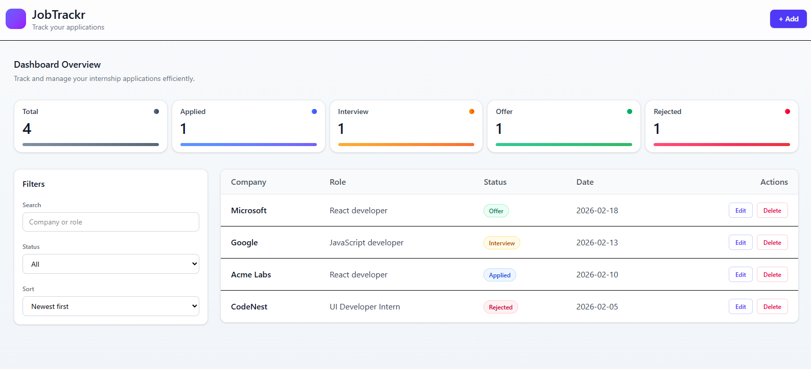
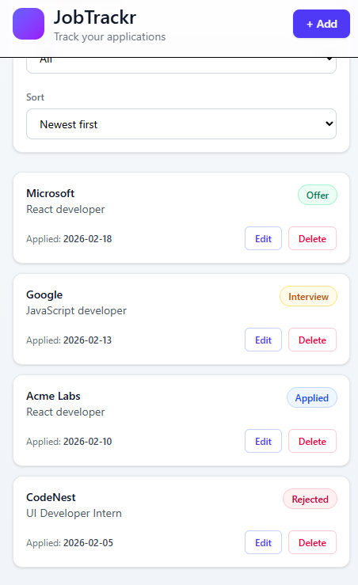

# JobTrackr – Internship Application Tracker

A modern SaaS-style dashboard built with React and Tailwind CSS to track and manage internship applications efficiently.

🔗 Live Demo: https://jobbtrcaker.netlify.app/

## ✨ Features

- Add, Edit, Delete applications (CRUD)
- Modal-based form interaction
- Search by company or role
- Filter by status (Applied, Interview, Offer, Rejected)
- Sort by applied date (Newest / Oldest)
- Dashboard statistics overview
- Responsive design (Mobile + Desktop)
- LocalStorage persistence (data remains after refresh)

## 🛠 Tech Stack

- React (Vite)
- Tailwind CSS
- JavaScript (ES6+)
- Netlify (Deployment)

## 📐 Architecture & UI Decisions

- Form is implemented as a modal for clean dashboard layout
- Sidebar contains filters only (SaaS pattern)
- Table converts to card layout on mobile
- Layout width is capped for better readability on large screens
- State management handled via React hooks
- Persistent state using localStorage

## 🚀 Getting Started (Local Setup)

```bash
git clone https://github.com/your-username/jobtrackr.git
cd jobtrackr
npm install
npm run dev
```

## 📸 Screenshots

### Desktop View

;

### Mobile View

;

### From View


